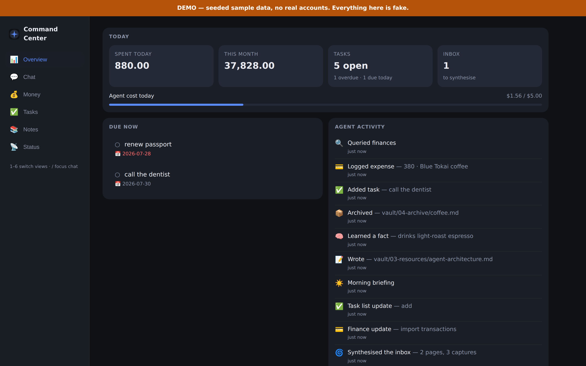
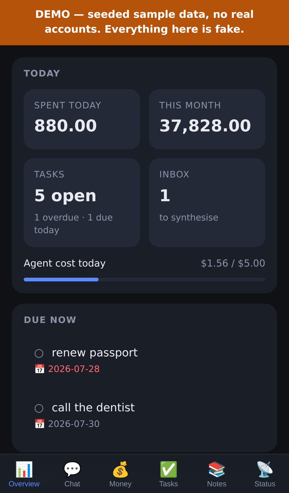
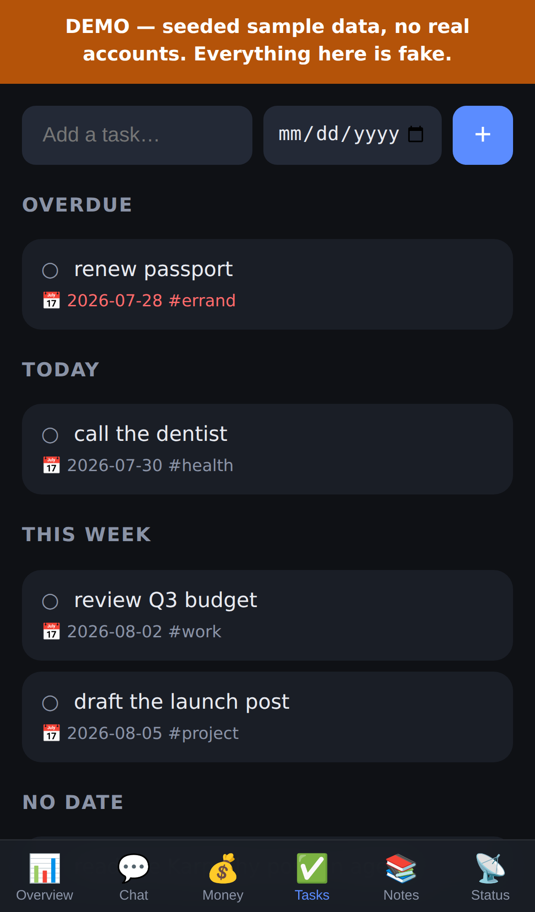
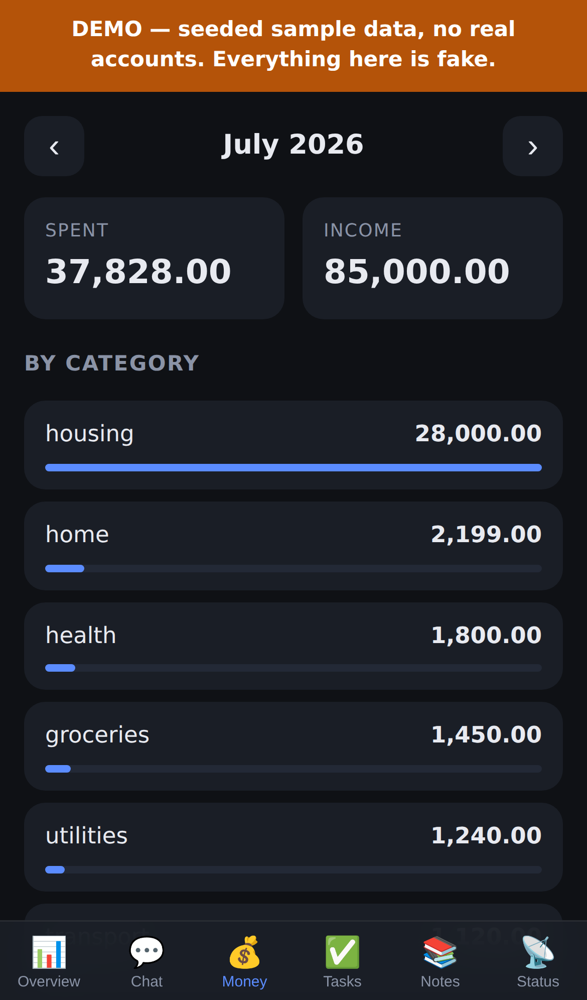
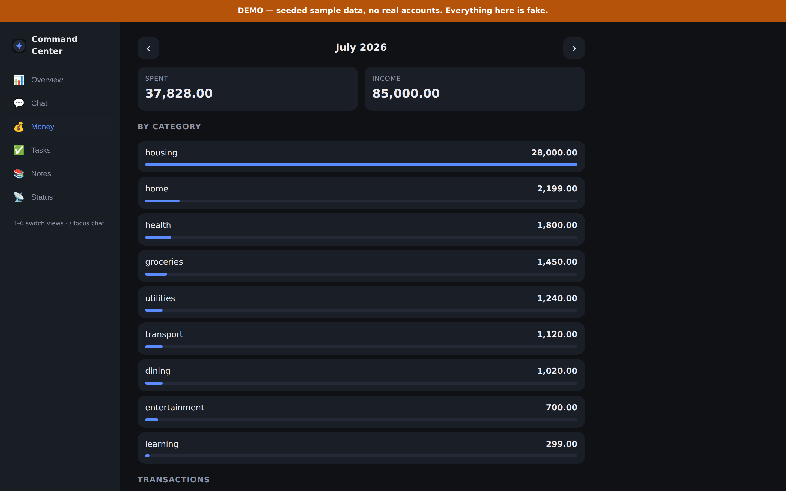
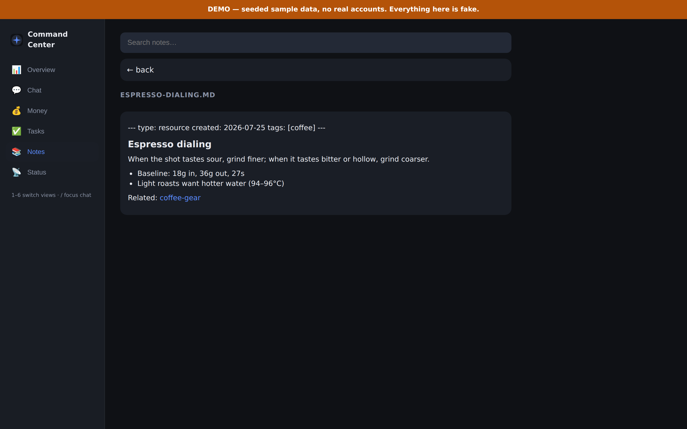

<div align="center">

# Personal Agentic Command Center

**A self-hosted AI agent I actually use every day — reachable as an installed
iPhone app and a desktop dashboard, over a git-backed personal data plane.**

One brain (tool-using LLM agent with human-in-the-loop approvals) · three
surfaces · zero SaaS. Passkey-locked, budget-capped, self-improving.

[](https://github.com/sreekar9601/personal-ai/actions/workflows/deploy.yml)








</div>

---

## What it does

Text it a sentence and the right thing happens — no forms, no app-switching:

| You say | It does |
|---|---|
| *"spent 450 on groceries at BigBasket"* | Validates and appends a categorised ledger row; the Money tab updates |
| 📷 *a receipt photo* | Reads it with vision, extracts total/merchant/date, logs the expense |
| *"remind me to renew my passport by August"* | Adds a dated task to `vault/tasks.md` |
| *"idea: a weekly newsletter about what I shipped"* | Files a capture; the nightly loop folds it into a cross-linked wiki |
| *"what did I spend on dining last month?"* | Answers from the ledger with SQL, not guesswork |
| *(nothing — 7:30am)* | Pushes a briefing to your lock screen: what's overdue, yesterday's spend, inbox depth |

## Why it's interesting (engineering)

- **Genuinely agentic**: tool use with **human-in-the-loop approvals** —
  irreversible writes suspend the turn, persist their state, and resume on your
  tap from *either* surface.
- **Self-improving, with a hard boundary**: a weekly reflection loop rewrites its
  own `skills/` and `playbooks/` autonomously, but `agent/` source sits outside
  the write allowlist — behaviour evolves, capability stays reviewed.
- **Judgement in the model, determinism in code**: the LLM supplies fields;
  tested Python validates, signs, de-dupes, and writes. Money is never
  "generated".
- **Cost as a design constraint**: three model tiers, prompt caching, bounded
  history, per-model token accounting, and a daily budget guard that declines
  politely instead of surprising you. Runs at roughly $10–30/month all-in.
- **Git as the database**: every action is a commit — audit trail, backup, and
  desktop sync in one. The vault opens directly in Obsidian.
- **Security-first**: WebAuthn passkeys, strict CSP, path-traversal-guarded file
  APIs, secret-pattern write refusal, and a one-flag kill switch.

📐 **[docs/ARCHITECTURE.md](docs/ARCHITECTURE.md)** — system diagram, the life of
a single turn, module map, security and cost models.

## Stack

`Python 3.12` · `Pydantic AI` (model-agnostic agent) · `FastAPI` + SSE ·
`WebAuthn` passkeys · `SQLite` FTS5 · `DuckDB` (ledger analytics) ·
`Web Push` (VAPID) · `APScheduler` · vanilla-JS PWA · `Fly.io` ·
`GitHub Actions`

## The surfaces

**iPhone app (PWA)** — installed to the home screen, unlocked with Face ID.
Chat capture, 📷 receipts, keyboard-mic dictation, tasks, money, notes, and
lock-screen push. No App Store, no developer account.

**Desktop dashboard** — the same app at ≥768px: sidebar nav, two-column panel
grid, `1`–`6` / `/` keyboard navigation.

<div align="center">


</div>

**Telegram (optional)** — a second transport over the same brain; leave
`TELEGRAM_BOT_TOKEN` unset to run app-only.

## Try it locally

```bash
uv sync
cp .env.example .env          # add ANTHROPIC_API_KEY
DEMO_MODE=true uv run python -m agent.main
```

Open http://localhost:8080 — **demo mode** serves a seeded fake data plane from
a temp directory with auth bypassed, so you can click through everything without
configuring anything. (Never set `DEMO_MODE` on a real instance.)

For real use, drop `DEMO_MODE` and fill in `.env` (see `.env.example`).

## Deploy (Fly.io)

One machine, one process, one volume. The volume holds a git clone of this repo
(your knowledge) plus SQLite, so redeploys keep every byte.

```bash
fly launch --no-deploy
fly volumes create personal_ai_data --size 1
fly secrets set \
    ANTHROPIC_API_KEY=... DAILY_BUDGET_USD=5 \
    GIT_REMOTE_URL=git@github.com:<you>/<repo>.git \
    GIT_SSH_KEY="$(cat deploy_key)"
# fly.toml: set PWA_ORIGIN to this app's public URL (passkeys bind to it)
# Optional Telegram: also set TELEGRAM_BOT_TOKEN + TELEGRAM_ALLOWED_USER_IDS
fly tokens create deploy | gh secret set FLY_API_TOKEN   # merge -> auto-deploy
fly deploy                                              # first deploy only
```

Then, on the phone: open the URL in Safari → **Share → Add to Home Screen** →
open it → paste the enrollment token from `fly logs | grep enroll` → create your
passkey → save the recovery code → **Status → Enable notifications**.

After that, every merge to `main` tests and deploys itself.

## Safety model

- **Passkey-only access** (WebAuthn/Face ID); enrollment closes after first use,
  with a one-time recovery code for a lost phone.
- **Fail-closed startup**: the Telegram surface refuses to run with an empty
  allowlist unless `DEV_MODE=true`.
- **Approval gate**: writes outside `vault/ skills/ playbooks/ memory/
  finance/transactions/` need your tap, and survive a restart.
- **Path safety**: any path escaping the repo root is refused; the notes API
  re-checks containment after resolution.
- **Content guards**: oversized writes and private-key material are refused.
- **Read-only finance queries**: single `SELECT`/`WITH` statements only.
- **Budget guard**: `DAILY_BUDGET_USD` caps estimated spend per day.
- **Kill switch**: `KILL_SWITCH=true` disables every side effect at once.
- **Audit**: git commits + `vault/log.md` + `.data/audit.log`.

## Editing the vault

Open `vault/` (not the repo root) as an Obsidian vault; the Git plugin pulls the
agent's commits to your desktop. Notes, tasks, and the ledger are plain
markdown/CSV — readable in 30 years, with or without this app.

## Tests

```bash
uv run --group dev pytest    # 112 tests, no network or model calls
```

Covers path safety and content guards, the approval gate, ledger
import/categorisation/query guards, the task store, retrieval, the activity
feed, spend accounting and the budget guard, WebAuthn session handling,
demo-mode isolation, and the API surface.

## Switching models / providers

Edit `agent/models.yaml` — `provider` plus three tier strings and their prices.
No Python changes.

## Build history

| Phase | What it added |
|---|---|
| 0 — core | Capture + spec writing, approval-gated writes, SQLite+FTS memory, tier-routed models, git as sync |
| 1 — knowledge engine | Wiki **synthesis loop**, keyword retrieval over the vault, active memory layer |
| 2 — contacts & pipelines | File-based CRM: people, organisations, and a status tracker with next actions |
| 3 — finance | CSV import → categorised ledger → DuckDB spending queries |
| 4 — proactive | Nightly synthesis + morning briefing on a scheduler |
| 5 — self-improvement | A reflection loop that writes its own reusable skills |
| 6 — hardening | Content guards, an audit trail, a pytest suite |
| 7 — durability | Volume-backed data plane, fail-closed auth, persistent approvals, budget guard, CI/CD |
| 8 — the phone app | Installable PWA: passkey auth, chat + approvals, receipts, Web Push |
| 9 — command center | Tasks, activity feed, Overview home, desktop dashboard, demo mode |

Plans live in [`PLAN.md`](PLAN.md), [`docs/PWA-DESIGN.md`](docs/PWA-DESIGN.md),
and [`docs/COMMAND-CENTER.md`](docs/COMMAND-CENTER.md).

---

<sub>Built with AI assistance; architected, reviewed, and operated by me. It runs
24/7 and commits its own morning briefings — the git history is the uptime
log.</sub>
