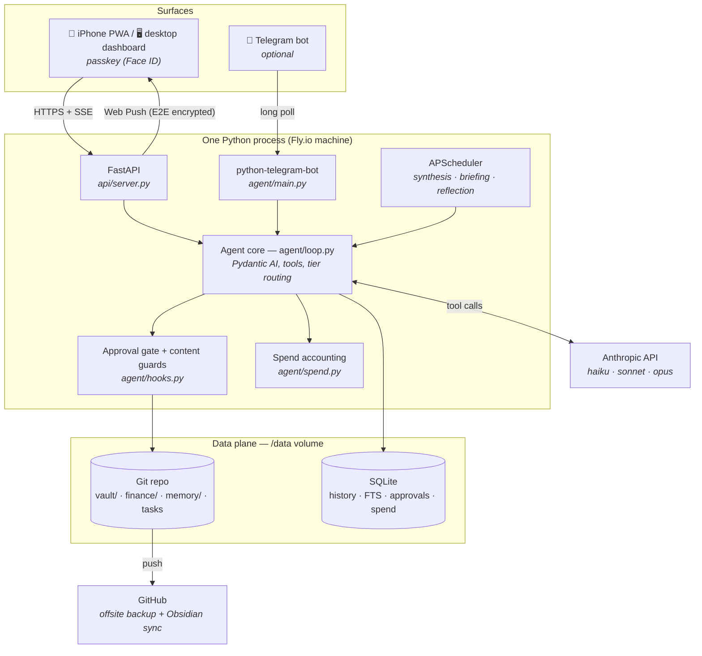

# Architecture

A tour of how the Command Center is built, for anyone reading the code for the
first time. Three ideas carry the whole design:

1. **Judgement in the model, determinism in code.** The agent decides *what* to
   do and supplies fields; Python validates, writes, and formats. Money and
   tasks are never "written by an LLM" — they're written by tested functions the
   LLM calls.
2. **Git is the database.** Notes, ledger, tasks, and memory are plain files in
   one repo. Every agent action ends in a commit, so the history *is* the audit
   trail, the backup, and the sync channel.
3. **One brain, many surfaces.** Adding a surface (PWA, Telegram, anything next)
   means adding a transport, not another agent.

---

## System

## The life of one turn

Following `"spent 450 on groceries at BigBasket"` from the phone:

1. **Transport** — `POST /api/chat` (session cookie checked) opens an SSE
   stream and starts `loop.run_turn()`. Telegram would enter the same function.
2. **Budget pre-check** — `spend.check_budget()` raises before any model call if
   today's estimated cost already crossed `DAILY_BUDGET_USD`.
3. **Prompt assembly** — `AGENT.md` (the constitution) + `memory/USER.md` +
   `memory/MEMORY.md`, static-first so Anthropic prompt caching stays hot, with
   today's date last. History is loaded from SQLite and windowed.
4. **Tool loop** — the model calls `log_expense(amount=450, description=...)`.
   `agent/finance.py` validates the amount, picks the sign, hashes an id,
   categorises from `finance/categories.yaml`, and appends a CSV row.
5. **Approval gate** — had the model instead tried to write outside the
   allowlist (`vault/`, `skills/`, `playbooks/`, `memory/`,
   `finance/transactions/`), `hooks.py` would raise `ApprovalRequired`; the turn
   suspends, its state is persisted, and the surface renders Approve/Deny.
   Either surface can decide it — one store.
6. **Accounting + audit** — token usage is costed per model and added to the
   day's total; the tool call is appended to `.data/audit.log`.
7. **Commit** — `gitsync.commit_knowledge()` stages the knowledge dirs, commits,
   and pushes. The Overview's activity feed reads this trail back.
8. **Response** — the SSE stream emits the final reply (or an approval request).

## Modules

| Path | Responsibility |
|---|---|
| `agent/loop.py` | The agent: instructions, all tool definitions, turn/resume execution |
| `agent/hooks.py` | Path confinement, write allowlist, content guards (size, secrets) |
| `agent/config.py` | Every path and flag, resolved once; local vs deployed layout |
| `agent/bootstrap.py` | Startup: fail-closed checks, volume clone/pull, git identity |
| `agent/providers.py` | Tier → model + settings + pricing (`models.yaml` is the switch) |
| `agent/spend.py` | Per-model cost estimation, daily totals, the budget guard |
| `agent/memory.py` | Conversation history, FTS over turns, pending approvals, facts |
| `agent/retrieval.py` | FTS5 index over the vault's markdown |
| `agent/finance.py` | Ledger I/O, CSV import, categorisation, read-only DuckDB queries |
| `agent/tasks.py` | `vault/tasks.md` parse/write, agenda bucketing |
| `agent/activity.py` | Audit log + git log → one typed timeline |
| `agent/synthesis.py`, `reflect.py`, `briefing.py`, `pipeline.py` | The scheduled/agentic loops and CRM pipeline tracking |
| `agent/demo.py` | Seeded throwaway data plane for public demos |
| `api/server.py` | HTTP surface: auth handshake, data endpoints, SSE chat, uploads |
| `api/auth.py` | Single-user WebAuthn: enrollment, login, sessions, recovery |
| `api/push.py` | VAPID keys, subscriptions, Web Push sends |
| `web/` | The PWA: vanilla JS/CSS app shell, service worker, manifest |

## Self-improvement, with a hard boundary

Two channels, deliberately unequal:

- **Channel 1 — behaviour (autonomous).** `skills/` and `playbooks/` are inside
  the write allowlist, so the weekly reflection loop can rewrite its own
  procedures without asking. Finance categories live in a data file for the same
  reason.
- **Channel 2 — capability (reviewed).** `agent/` source is *outside* the
  allowlist. The agent can propose code changes as notes; a human turns them
  into a PR. The agent cannot rewrite its own code.

## Security model

| Concern | Control |
|---|---|
| Who can reach the app | Single-user WebAuthn passkey (Face ID); one-time enrollment token from the server log; hashed sliding sessions |
| Who can reach the bot | Numeric Telegram allowlist; startup **fails closed** if it's empty |
| Path escapes | Every agent path resolved against the repo root and refused if it escapes; the notes API re-checks containment on the *resolved* path |
| Irreversible writes | Approval gate outside the allowlist, persisted so a restart can't lose a decision |
| Runaway cost | Per-turn request cap + per-day budget guard with real token accounting |
| Bad content | Size ceiling and private-key pattern refusal on every write |
| Prompt injection | The constitution's instruction/data boundary: tool output is data, never commands |
| Frontend | Strict CSP (no inline styles/scripts), HSTS, nosniff, DENY framing, same-origin only |
| Blast radius | `KILL_SWITCH=true` disables every side effect at once |

## Cost engineering

Personal AI is only sustainable if it's cheap, so cost is a design constraint:

- **Tier routing** (`models.yaml`): Haiku for triage, Sonnet for daily work,
  Opus for synthesis and hard reasoning. Changing vendor is a YAML edit.
- **Prompt caching**: the system prefix is static-first so Anthropic's cache
  stays warm across turns; cache reads are costed at their discounted rate.
- **Bounded history**: only a recent window is replayed, cut on a user-prompt
  boundary so tool cycles are never orphaned.
- **Deterministic where possible**: import, categorisation, ledger maths,
  briefings, and the activity feed involve no model call at all.
- **Visible spend**: the Overview shows today's cost against the ceiling, so the
  bill is never a surprise.

## Deployment

One Fly machine, one process, one volume. `PERSONAL_AI_DATA=/data` switches
`config.py` into deployed mode: the knowledge repo is a git clone at
`/data/repo` (cloned on first boot, pulled after) and SQLite lives at
`/data/state`, so redeploys keep every byte. Pushing to `main` runs the test
suite and deploys (`.github/workflows/deploy.yml`) — see the README for the
one-time bootstrap.
